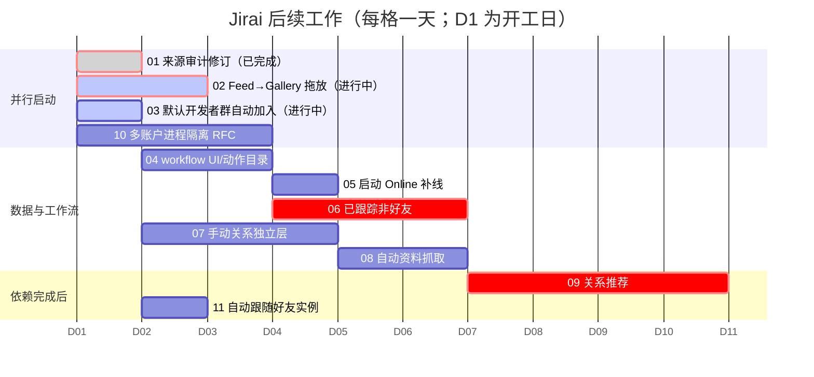

# Jirai 后续总执行规划

> 本规划只定义后续工作，不在本轮直接实现功能。所有任务都应从当前
> `port/legacy-audit-simple-ui` 分支继续，且不得自动合并 `upstream/master`。

## 对第二次批注的回答与已修正判断

### 简化自动加群

同意：旧实现仅在获取当前用户群组后判断固定 `groupId` 是否已存在；缺失且设置开启时调用一次
`joinGroup`。下一轮复用当前 `groupProfileRepository.joinGroup()`，不做 toast、状态卡或额外提醒；
成功后仅刷新群组缓存。设置的默认值和是否默认开启按旧 Jirai 行为确认，不添加复杂状态机。

### 命名兼容

同意：新表、领域名、DTO 名尽可能保留旧 Jirai 名字：
`tracked_nonfriends`、`manual_relations_MANUEL`、`user_id_a`、`user_id_b`、`relation_type`、
`added_at`。仅因 Rust/现有仓库约定必须改变时，在任务文档中记录一对一名称映射；不为“更优雅”重命名。

### 手动关系的正确迁移边界

同意用户的记忆。旧 Jirai 已用独立的、带 `added_at` 的
`{prefix}_manual_relations_MANUEL` 表，而不是改写好友/共同好友表。当前迁移也应保持该策略：
在上游互惠关系图读取之后叠加绿色人工边，**不修改**上游的
`*_mutual_graph_friends`、`*_mutual_graph_links` 或其抓取流程。这是“引用与劫持”而非重写。

### 关系推荐依赖的含义

此前 `F/G/T/M` 缩写不清楚，现改用全称：

```mermaid
flowchart LR
    A[当前账户 Feed 与 GameLog 历史] --> R[关系推荐]
    B[上游互惠好友图快照] --> R
    C[已跟踪非好友表与刷新] --> R
    D[手动关系独立表与图覆盖] --> R
    R --> E[推荐解释、接受与忽略界面]
```

- A、B 是当前已有的只读输入；
- C 让推荐覆盖非好友；
- D 不是最小计算公式的数学前提，但它是接受建议、去重和呈现人工确认关系的产品前提；
- 因而推荐必须排在 C、D 后，不能抢跑。

### “补上线记录”的最小规则

同意简化为用户指定的规则，且不回填虚构的 13:00：应用启动/好友列表初始化时，若目标当前为在线、
而该用户最近一条 Online/Offline 历史是 `Offline`（或不存在），就在**当前确认时刻**写一条 `Online`。
不为“当前离线且上一条在线”补 `Offline`，不回写过去的时间，不做额外来源筛选 UI。它可按普通历史记录
参与统计。任务仍需保证同一启动批次不会重复插入。

旧 Jirai 的 Previous Instances “Fake Record”并不是这个启动补线逻辑：它由 FuLu糖福禄在
`c4f1a461` 加入原有的 Previous Instances 对话框，手动插入 5 秒
`OnPlayerJoined`/`OnPlayerLeft`。因此把两项分为“启动 Online 补线”和“Previous Instances 手动补实例记录”，
后者不在近期执行范围。

### 自动同步层与 workflow UI

旧 Jirai 的 `updateLoop()` 每 **1 秒**自我调度一次；计数器到期才执行动作。以下为完整、已核查的节拍，
而不是“等”：

| 节拍/触发 | 旧实现完整路径 | 执行动作 | 与其他层的关系 |
| --- | --- | --- | --- |
| 登录初始化一次 | `/home/fulutang/Documents/Github/VRCX-jirai/src/coordinators/friendSyncCoordinator.js` `runInitFriendsListFlow()` | 初始化好友日志、加载好友、建立搜索索引、载入统计，非阻塞调用 `runSilentInfoFetch()` | Info Fetch 对好友与已跟踪非好友逐个拉 Bio/状态 |
| 好友列表刷新或 WS 重连后 | 同文件 `runRefreshFriendsListFlow()` | 刷新当前用户（必要时）、刷新好友、重连 WS，非阻塞调用 `runSilentInfoFetch()` | 每小时好友刷新也会走这里 |
| 每 1 秒 | `/home/fulutang/Documents/Github/VRCX-jirai/src/stores/updateLoop.js:73-160` | 驱动所有倒计时；Linux 下读取游戏日志、检查游戏/VR 运行状态 | 不是资料 API 刷新 |
| 每 5 分钟 | `updateLoop.js:76-79` | `getCurrentUser()` 刷新本人资料 | 仅当前账户本人 |
| 每 5 分钟（好友加载后） | `updateLoop.js:96-104` | 拉取群组用户实例、处理群组实例、检查游戏运行 | 不写 Bio/Status |
| 每 1 小时 | `updateLoop.js:80-90` | `runRefreshFriendsListFlow()`、保存账户、必要时刷新 moderation | 随后触发一次好友+追踪对象 Info Fetch |
| 每 1 小时 | `updateLoop.js:92-95` | `refreshTrackedNonFriendsFlow()` | 再单独逐个拉已跟踪非好友的 Bio/状态；旧实现会与上行的 Info Fetch 重叠 |
| 每 1 小时 | `updateLoop.js:105-110` | 更新检查、注册表自动备份 | 与 Jirai 社交迁移无关 |
| 每日 | `updateLoop.js:150-152` | 数据库 optimize | 与 Jirai 社交迁移无关 |
| Info Fetch 单次运行 | `/home/fulutang/Documents/Github/VRCX-jirai/src/coordinators/infoFetchCoordinator.js:86-196` | 目标去重→逐人 API 拉取→Bio 差异写入→四种状态差异写入→调用推荐计算 | 要防重入；当前迁移在推荐尚未实现时应将推荐步骤标为跳过 |
| 非好友单次刷新 | `/home/fulutang/Documents/Github/VRCX-jirai/src/coordinators/nonFriendCoordinator.js:12-87` | 加载 `tracked_nonfriends`→逐人 API 拉取→更新 display name、Bio、状态→重载名单 | 应与 Info Fetch 合并为一个调度入口，避免旧版同小时双扫 |

新实现不盲抄旧版的“同小时双扫 tracked nonfriends”：workflow 动作目录会保留所有动作和频率，
但每轮只为同一目标执行一次资料拉取。用户给出的 `workflowUI示意图.png` 是“步骤列表 +
完成/跳过/失败/进行中 + 汇总”的交互目标。下一轮先实现这个通用工作流状态模型和**一个**可运行动作：
好友启动补 Online；其余已识别动作作为列表项显示，按依赖条件标记“跳过（尚未实现/缺少追踪名单）”，
不得假装运行。

### 页面还原与无头环境

页面视觉是迁移验收的一部分。代理优先根据旧组件结构、类名、文案、交互状态做 React 等价实现；
Linux 无头环境下先做组件测试、生产构建和可获得的静态截图。若无法可靠运行 Tauri GUI，代理应通过 QQ
提醒用户进行 Windows 手工截图/交互验收，而不是声称已验证视觉效果。

### 多账户

只做长期 RFC，不实现。它从 Day 1 与其他工作并行，因为不依赖功能来源审计。调研已得出三条路线：
单进程多会话（冲突最大）、多个独立 GUI+`--data-dir`（临时可用）、管理器 GUI + 每账号独立 worker
进程 + 本地 IPC（推荐目标）。详细任务见 `执行任务/10-多账户进程隔离-RFC.md`。

## 任务与依赖

| 编号 | 任务 | 直接依赖 | 可并行 | 本阶段性质 | 独立提交节点 |
| --- | --- | --- | --- | --- | --- |
| 01 | 功能来源审计修订 | 无 | 02、03、10 | 文档 | 审计结论、来源归属与任务 brief 复核完成后提交 |
| 02 | Feed 图片拖放到 Gallery | 无 | 01、03、10 | 实现 | 拖放入口、Gallery 接收和组件测试/构建通过后提交 |
| 03 | 默认开发者群自动加入 | 无 | 01、02、10 | 实现 | 设置、静默加群调用、缓存刷新和测试通过后提交 |
| 04 | workflow UI 与调度目录 | 01 | 05、06、07 | 实现/架构 | 状态模型、动作目录、跳过态 UI 和测试通过后提交 |
| 05 | 启动 Online 补线 | 04 | 06、07 | 实现 | 当前时刻 Online 写入、防重与历史测试通过后提交 |
| 06 | 已跟踪非好友 | 04 | 05、07 | 实现 | `tracked_nonfriends` 迁移、CRUD、刷新入口及测试通过后提交 |
| 07 | 手动关系独立层 | 01 | 05、06 | 实现 | `manual_relations_MANUEL` 迁移、CRUD、绿色图覆盖及测试通过后提交 |
| 08 | 自动资料抓取 | 04、05；扩展部分依赖 06 | 07 | 实现 | 合并调度、防重拉取、Bio/状态写入与测试通过后提交 |
| 09 | 关系推荐 | 06、07、08 | 无 | 实现 | 算法、解释/接受/忽略界面和端到端验证完成后提交 |
| 10 | 多账户进程隔离 RFC | 无 | 全部 | 仅调研 | RFC、风险评估与阶段性接口建议定稿后提交 |
| 11 | 自动跟随好友实例 | 无 | 09、10 | 实现（低验证优先级） | 实例监听、启动/重启保护和可复现实测完成后提交 |

## 执行状态（由主对话维护）

> 状态以主对话的审查结论为准；“进行中”只表示已有子代理在共享工作区执行，**不**等同于可提交。

| 编号 | 当前状态 | 最近审查/下一步 | 对应独立提交 |
| --- | --- | --- | --- |
| 01 | 已完成 | 来源审计、任务 brief 与规划已复核 | 已由规划文档提交覆盖 |
| 02 | 进行中 | 子代理实现 Feed→Gallery；主对话随后审查、测试与反馈 | 等验收通过后建立实现提交 |
| 03 | 进行中 | 子代理定位群组加载入口并实现静默自动加入 | 等验收通过后建立实现提交 |
| 04 | 未开始（等待 02、03 审查窗口） | 先确认 UI/设置改动不会占用相同入口，再启动 | workflow 状态模型验收后 |
| 05 | 未开始（依赖 04） | 等 workflow runner 稳定后实施 | Online 补线测试通过后 |
| 06 | 未开始（依赖 04） | 等 04 的动作接口定型 | 非好友表与刷新验收后 |
| 07 | 未开始 | 可在 02、03 收尾后排期 | 独立表及图覆盖验收后 |
| 08 | 未开始（依赖 04、05） | 等补线语义和调度接口确认 | 合并抓取调度验收后 |
| 09 | 未开始（依赖 06、07、08） | 禁止抢跑 | 推荐端到端验收后 |
| 10 | 未开始 | RFC 调研可与低风险实现并行，但不实现 | RFC 定稿后 |
| 11 | 未开始 | 低验证优先级，待前两项主线稳定 | 实测完成后 |

## 每日格排期（相对开工日）

图中的 `D1` 是确认开工后的第一天；`2026-01-01` 只是 Mermaid 的零点锚，不是实际日期。
每一个时间格代表一天，实际任务可在数小时内完成并提前结束。

> Mermaid 的 `after` 只能表达一个前置任务。执行时必须同时检查上表中的全部直接依赖；特别是
> 09 还必须等待 07 和 08 完成。

## 子代理协作与交付纪律

1. 每个任务都先读其 `执行任务/` 下的独立 brief，再委派子代理；不得只给一句“移植功能”。每份提示词必须写明目标、不可触碰的边界、当前依赖、验收方式，以及旧代码的**完整绝对路径**。
2. 子代理可以查旧代码和直接实现其被分配的变更，但**不得自行 `git add`、`git commit`、rebase、merge 或重置工作区**。主对话统一审查 diff、解决冲突、运行测试并创建提交。
3. 所有人共用同一个工作区，不创建第二份工作目录。因此主对话在启动前必须核对各任务的写入文件范围：
   - 写入范围重叠、存在先后依赖，或需要读取对方尚未稳定的接口时，必须串行调度；
   - 范围不重叠时才可并行；提示词须告知对方并行任务的名称、共享接口和禁止修改的文件；
   - 子代理报告范围外改动、冲突标记或工作区已有未预期修改时，立即停止其后续改动，由主对话处理。
4. 模型按难度选择：Luna 用于明确、局部、低风险的查阅或 UI/测试任务；Terra 用于跨 Rust/TypeScript 边界、持久化迁移、调度并发、算法设计及需要综合旧代码语义的任务。不能因并行方便而降低复杂任务的模型或提示词质量。
5. 每个子代理只改其任务明确列出的文件/边界；遇到上游数据表或 runtime 核心改动必须停下报告。
6. 主对话负责检查旧代码复用点、命名兼容、依赖是否满足、测试和视觉证据。
7. 每项完成后由主对话独立提交；不把未验证的复杂数据库任务与简单 UI 任务混合提交。
8. 未经用户新的明确要求，不执行 09、10 的实现，也不启动 Previous Instances 手动补实例记录。
