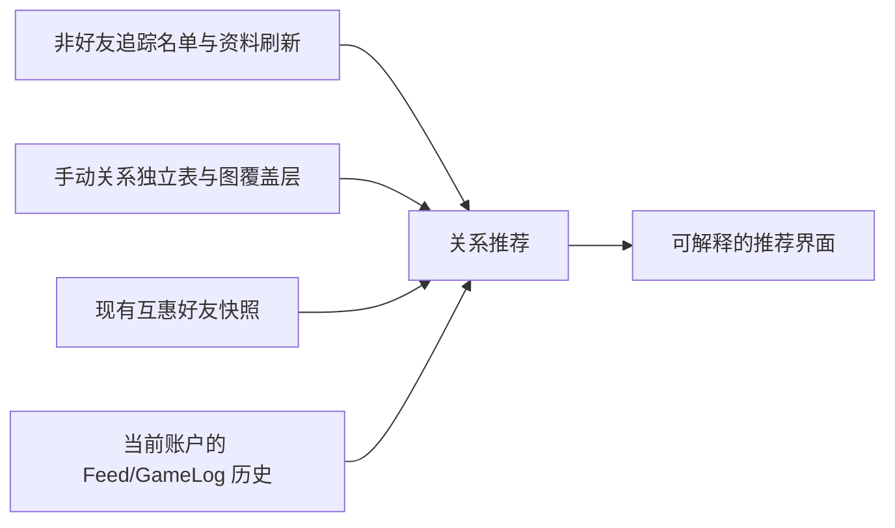
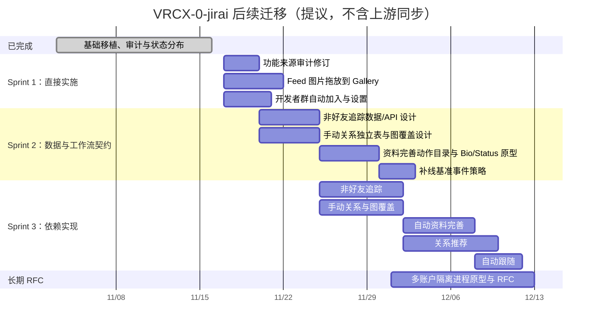

# Jirai 迁移评审结论与迭代计划

> 本文逐项消化 `旧版功能清单.md` 与 `reports/` 中用 `{…}` 标注的评价。
> 标注保留在原文中；本文是可执行的决策、澄清和依赖图，不修改用户原始意见。

## 结论摘要

下一轮分成两个并行小目标：

1. **直接实施**：Feed 图片拖放上传到 Gallery；Jirai 默认开发者群自动加入（带现有设置页开关、可见结果和失败提示{结果不可见，无提醒，因为用户可以直接登录游戏检查，而且本来也只是一个判断+api调用，没有什么复杂的东西}）。
2. **先建立可实施规格**：非好友追踪、手动关系、资料补全自动工作流与历史补线。它们是关系推荐的前置依赖，不能再被笼统标记为“以后再说”。

多账户暂不实现；单独进行 Rust-first 架构 RFC。状态历史分布保留：其初版来自 Copilot 提交 `137abf6f`，但后续由 FuLu糖福禄在 `cf942bd0` 重构为按时长统计并支持自我追踪，符合“作者本人或其合入贡献”的审计范围。{但是单独开terra的subagent让它进行调研，然后主对话根据用户的意志(已在之前那个详解文档中用花括号括出)与subagent进行交互，最后给出一个多种技术路线的选择和解析}

## 对评价的逐项回应

### 1. 非好友追踪并不受当前 Feed 表结构限制

**结论：可实现，且应进入关系推荐的前置工作。**

当前 Feed 表以“当前登录账户”为数据所有者（表前缀），但每一行的
`user_id` 没有“必须是好友”的外键或约束；例如
`crates/persistence/src/realtime/schema.rs` 中的 `*_feed_gps`、
`*_feed_status`、`*_feed_bio` 与 `*_feed_online_offline` 都只是保存任意
`user_id`。因此，数据结构允许保存非好友资料。

此前报告真正表达不准确：**实时好友 WebSocket 流只能天然观察好友；并非数据库拒绝非好友。**
非好友追踪需要新增的是“订阅名单”及有节流的资料 API 拉取服务：

- 新的所有者范围 `tracked_subjects` 表，只记录用户显式要求追踪的 ID、显示名、启用状态与时间；
- 使用现有 `userProfileRepository.getUserProfile({ userId, force: true })` 对非好友拉取资料；
- 将获得的 Bio/状态变化以明确的 `api_refresh` 来源写入现有 Feed 持久化路径；
- 不把非好友伪装成好友，也不把它们写入 `mutual_graph_*` 的“好友快照”。

这样既能满足“抓取非好友数据”，又不污染好友关系的事实模型。{思路不错，但是希望表名，变量名之类的尽量和vrcx-jirai里面的一致(方便理解与迁移)}

### 2. 手动关系本来就应是独立表和显示层

**同意。** 旧版确实用独立的 `{prefix}_manual_relations_MANUEL` 表保存手动边；
问题不是“要不要独立”，而是新实现不能为图方便把这类边写进当前
`*_mutual_graph_links` 观测快照。新表 + 图上的显式覆盖层正是旧行为在当前架构中的等价、可维护迁移。{你重新看一下vrcx-jirai与vrcx在这个方面的区别。我记得具体来说，是，尽量不动上游(对我们来说就是vrcx-0)的这个部分的代码和数据结构，仅在其他部分做引用和劫持。比如，vrcx-jirai相比vrcx多了个有记录时间的表，你可以去看 VRCX-jirai/docs/vrcx-mcd.svg 图的右下角，或者同文件夹里的其他图来帮助理解。简单来说，就是我对当时的表示人与人关系的数据表链接之间加了个"最后更新的时间"字段，来实现的永久性统计 }

### 3. 关系推荐的前置依赖

**结论：要迁移，按下列依赖顺序进行。**

推荐算法读取 `F`、`G`，并为完整 Jirai 行为使用 `T` 与 `M` {嗯？这几个字母是啥玩意？}。手动关系不是
计算最小可行版本的绝对技术前提，但它是接受/确认推荐和避免重复建议的产品前提；
因此本计划把它放在推荐之前。算法实现必须保留证据和置信度，不能把推测结果写成事实好友关系。

### 4. 状态历史分布是什么

旧入口为 `src/components/dialogs/UserDialog/UserDialogStatusDistributionTab.vue`：按某人
`Status` 与 `Online`/`Offline` Feed 事件估算其处于 Join Me、Active、Ask Me、Busy 的时长。
初版为 Copilot 的 `137abf6f`，FuLu糖福禄的 `cf942bd0` 把它改为时长计算且支持追踪自己。
本仓库已经以当前 owner-scoped Feed 实现了同等的按需资料窗口面板；它不增加数据库或新 Rust
查询命令。{像这种迁移，最主要的是尽量还原页面效果，你可以尝试自己编译然后截图，但是考虑到你是个无头的linux，或许对你来说有点困难的话，也可以给我发消息(你可以用qq给我发提醒)}

### 5. 自动跟随不是“追踪”

旧 `autoFollow.js` 的行为是：选定一个**好友**为目标，监听其 location；目标进入新的真实实例时，
本机立即打开该实例，必要时退出并重启 VRChat。它不是资料追踪，也不是邀请请求。

因为会主动启动/切换游戏，建议在非好友追踪之后再单独迁移，并采用默认关闭、明确目标、停止按钮、
冷却时间与每次动作可见提示。{这个就先尽量实现，不用太验证什么的，我之后单独关照}

### 6. “已覆盖”的准确含义与审计范围修正

“已覆盖”只表示当前上游 VRCX-0 已提供更完整的 owner-scoped Feed、Friend Log、通知或头像历史能力，
不是说那些功能由 Jirai 迁移而来。根据旧仓库的 `docs/JIRAI_FEATURES.md`，头像历史、Friend Log、
通知、Activity、Gallery 等本身属于上游功能，不是 Jirai 特有需求。

下一轮审计会把它们从“待迁移功能”列表移入“上游已有/排除”，并新增提交来源列：
`FuLu糖福禄 作者`、`由 FuLuTang 合入的 PR`、`上游已有`。这也会覆盖机器人或他人提交被作者采纳的情况。

### 7. 历史补线与合成记录

核查结果与“启动时统一轮询所有在线好友并自动补上线记录”的推测不同：

- 旧 `runSilentInfoFetch()`（`infoFetchCoordinator.js`）在启动/好友刷新后批量拉取 **Bio 与四种隐私状态**；它不写 Online/Offline 事件；
- 旧的 5 秒 `OnPlayerJoined`/`OnPlayerLeft` 写入位于 Previous Instances 对话框的**手动操作**，并以当前用户最近进入该实例的时间为起点；它不是启动自动轮询；{等等，这是vrcx的功能还是jirai的功能？我不记得我做过这个}
- 因此，当前或旧版都无法从 VRChat 的“当前在线”资料准确倒推出 13:00 的真实上线时间。Activity/Online Overlap 没有起始观测时只能忽略该段，或从最早已观测到的时刻起计算下界。

我不同意把未知的 13:00 当普通真实记录写入{我也没说要把13点当写入啊，当时软件没开没人会认为是可以记录13点}；这会把下界伪装为事实。但同意“17:00 已确认在线”是有价值的补线。
拟议实现是**可见但默认纳入常规统计的“补线基准事件”**：时间为本次 API/好友列表确认时刻，带
`source = profile_refresh_baseline` 与 `is_estimate = true`。普通 Activity/Overlap 可计入 17:00 之后的时长；
详情、导出、推荐计算可显示或选择排除其来源。这同时满足数据不继续缺失和可追溯性。{你说了这么多，说实在的考虑的有点多了，真的就非常简单的逻辑。刚开软软件，如果，这个玩家现在的状态是在线，且属于他的上一条记录是离线(也就是没能抓到本轮它上线)那么就把当前记录成他上线。但是仅补上线，不补下线记录(也就是不补反向的那个版本，就是没记录上次下线然后当前人不在就直接记录现在下线。这个不做)。}

### 8. 资料完善自动工作流

用户要求的方向成立：先恢复自动工作流，然后在界面列出动作与跳过原因。
但旧代码可证实的实际步骤是：

1. 遍历好友与已跟踪非好友；
2. 拉取资料，比较并写入 Bio；
3. 比较并写入四种隐私状态；
4. 触发关系建议计算。

它不是已定义的七个资料刷新动作。下一轮不能凭空制造另六项；先产出“动作目录”，把当前可验证的
步骤实现为可取消、可节流的前两个动作，将其余候选动作显示为“未实现：缺少规格/依赖”，并在轮到时
明确跳过。完成非好友追踪后，自动工作流再从好友范围扩展到追踪名单。{对的我的7是瞎说的。但是哦对我忽然想起来个事...我是不是做了好多层自动抓取？有开软件自己跑的，有隔几个小时一刷新的，还有几分钟一刷新的，然后还有的是隔几个小时一刷新但是开软件也刷新的...我有点乱了，而且有的也不全都挤在，呃，原本的vrcx-jirai右下角有一个刷新状态显示器，但是我忘了那个功能叫什么了，那个就是显示是否同步完成的那个，我说的“显示列表”，你可以参考 ./workflowUI示意图.png }

### 9. 多账户：不采用旧全局热替换；采用进程隔离路线

`venv` 是 Python 术语，不能隔离 Tauri/Rust 的认证和实时运行时。Terra 的架构审查确认：
当前 VRCX-0 从启动到 `RuntimeHostContext` 只构造一个数据库、`WebClient`/Cookie jar、认证 scope、
realtime runtime 和任务监管树；给前端命令加 `accountId` 并不能安全实现多账号。旧版 V4 的 Store/DB
前缀热切换也存在未完成接口和实时数据竞争，不能移植。

| 路线                                             | 可维护性 / 上游冲突                                    | 聚合能力                                 | 当前结论           |
| ------------------------------------------------ | ------------------------------------------------------ | ---------------------------------------- | ------------------ |
| 单进程 Rust 多会话 runtime                       | 最差：改动 composition、desktop host、IPC 和大量调用方 | 最强                                     | 不作为首版         |
| 多个完整 GUI 进程，各自`--data-dir`            | 很好：保留单账号核心                                   | 无统一 UI                                | 可做临时 MVP       |
| **单 GUI 管理器 + 每账号独立 worker 进程** | **中等：新 supervisor/IPC，核心 runtime 不动**   | **强：可实现带来源标签的只读聚合** | **推荐目标** |

当前已存在 `--data-dir` 对应的独立数据库、配置和缓存，以及每 profile 的 `runtime.lock`，因此进程隔离
在数据层面可行；但 Windows 固定 mutex 与 `tauri-plugin-single-instance` 目前会阻止第二进程，必须使其
区分 manager 与显式 account worker。也要明确只有 manager 持有托盘、通知、深链、自动启动、游戏/Overlay
和 Discord RPC，worker 只持有认证、API、WebSocket 和自身数据目录。

推荐分期：

1. 定义 `AccountId`、账户目录 manifest、worker capability matrix 和本地认证 IPC 合约；IPC 不得传输密码/Cookie。
2. 做 B 兼容 MVP：两个 `--data-dir` 隔离 worker 可同时登录、收 WebSocket、独立退出/重启，且没有重复 OS 集成。
3. 再做 C：manager 通过版本化 IPC 读取带 `accountId` 的朋友/Feed/通知摘要；详情与写操作路由回所属 worker，
   不直接打开另一个进程正在使用的 SQLite。
4. 只有进程和 IPC 开销经测量不可接受时，才重新评估单进程多会话。

## 下一轮执行范围

### 立即实施（Sprint 1）

- Feed → Gallery 的图片文件拖放上传，复用当前 Gallery 上传 API，含五区落点提示、文件类型/大小错误和组件测试。
- Jirai 开发者群自动加入：接入现有 group join repository；保留设置开关，记录成功/已加入/失败结果，避免每次启动重复请求。
- 重做功能清单的来源审计：只保留 Jirai 作者或由其合入 PR 的新增能力；把上游已有项移到排除附录。

### 先设计并建立测试契约（Sprint 2）

- `tracked_subjects` 数据模型、所有者隔离、API 刷新节流/取消和 Feed 来源字段；
- `manual_relations` 独立表、规范化 pair CRUD、图覆盖层；
- 资料完善动作目录及进度/跳过 UI，先实现 Bio + Status 的自动刷新；
- 补线基准事件的来源、统计与导出策略。

### 依赖满足后实施（Sprint 3+）

- 非好友追踪界面与资料刷新；
- 手动关系界面与图覆盖；
- 自动资料完善（先好友，随后扩展到追踪对象）；
- 关系推荐的确定性算法、解释和接受/忽略工作流；
- 独立的自动跟随。

## 甘特图（提议排期）

{不错，不过你确定前后依赖是正确的吗？你可以先去看之前的评论，然后顺便拆解一下每个任务的技术条件和其他任务之间的关系条件，然后二次确认排期设计的问题。，那比如，长期RFC的，为什么起步时间和功能来源审计修订不是同时起步呢。然后还有，下面那个日期不用写成这样，直接，呃，按一格一格一天一天算即可（因为搞不好一个任务你几个小时就干完了）}

本文件仅确定范围与设计方向。除用户明确要求的 Sprint 1 项目外，不会自动开始数据库迁移、非好友 API
轮询、合成基准事件、关系推荐或多账户实现；这些工作应在对应契约审查后启动。
